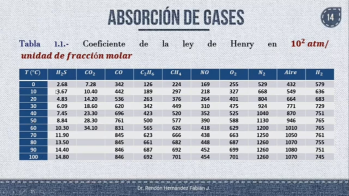
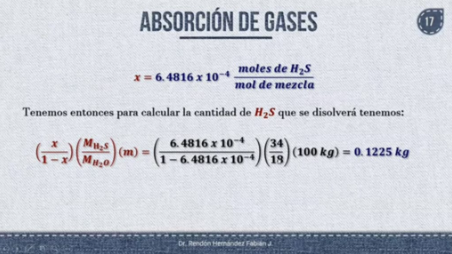
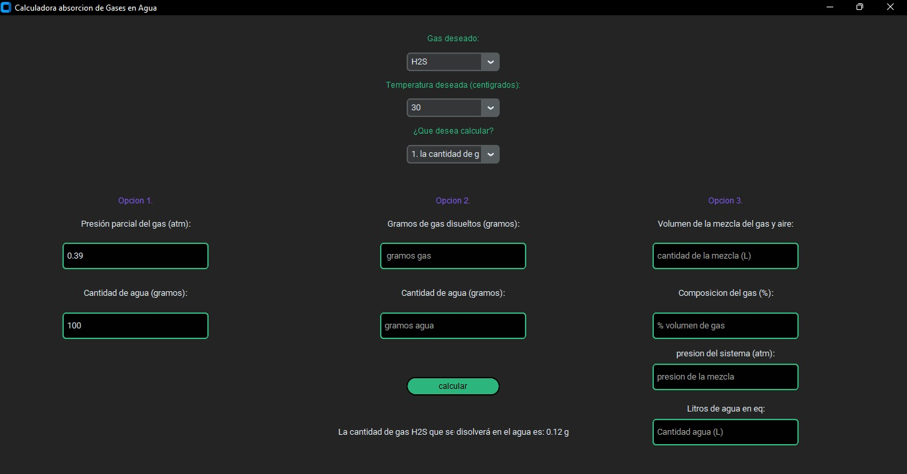

# Calculadora_operaciones_gas_liquido


NOMBRES: Heidy Tatiana Perez, David Andrei Joya Reinel

Para este proyecto nos enfocamos en la transferencia de masa por medio de equilibrio químico a través de la absorción de gases. Con esto en mente, utilizaremos la ley de Henry para el cálculo de los parámetros deseados.

* # Absorción de gases

Proceso muy común en ingeniería química en el cual se analiza un gas (soluto) y su disolución en un líquido (solvente) con el fin de obtener una disolución del gas deseado en el líquido.

  * # ¿Qué factores afectan la solubilidad de un gas en un líquido?

    Entre los factores que afectan la solubilidad de los gases en un líquido están:
      * Naturaleza de ambos componentes
      * Temperatura
      * Presión parcial
      * Concentración del gas disuelto en el líquido

* # Ley de Henry

Esta Ley puede aplicarse a disoluciones líquido-gas no ideales.

P = Hx  


* Variables utilizadas:

| Variable | Descripcion |
|---|---|
| H | Constnte ley de Henry |
| x | Concentración del gas en el líquido|
| p | Presión parcial del gas|

* Constantes de Henry para la disolución de gases en agua de acuerdo a su temperatura:



También se puede despejar la misma fórmula para determinar la masa de gas que se disolvió en el líquido.

x = P/H


Y acá está el programita para resolver el problema planteado (hasta le pusimos interfaz):

*disclaimer:* Es necesario tener instalado tkinter para que el programa corra con la GUI, si no lo tienen instalado también se puede correr sin la interfaz con el codiguito llamado "py.py"

```python


# PROYECTO calculadora de absorcion de gases 
# Tatiana Perez y David reinel

#Nos basamos en transferencia de masa por metodo de equilibrio quimica en la absrocion de gases, 
#en este programa se hace a presion de 1 atm y a diferentes temperaturas


#Primero importamos la libreria de customtkinter para la interfaz grafica y tkinter para hacer algunas cositas 
from customtkinter import *
from tkinter import PhotoImage, StringVar

# funcion para calcular la concentracion de la disolucion formada
def calcular_concentracion(presion_sis, volumen_agua, volumen_mezcla, constante_henry, composicion_gas, temperatura, gas_deseado):
    #constanre r de ley de los gases ideales
    constante_r = 0.08205
    #grados kelvin, para hallar valor absoluto
    k = 273.15
    # moles iniciales de solo el gas usando formula de gases ideales pv = nRT, despejamos n para hallar los moles iniciales del gas y pasarlos a gramos
    Ni = (presion_sis * (composicion_gas / 100) * volumen_mezcla) / (constante_r * (k + temperatura))
    # la misma formula anterior pero sin la presion para calcular de la concentracion ya que p = Hc y despejamos c 
    Nf = volumen_mezcla / (constante_r * (temperatura + k))
    #despejando la concentracion se calcula los gramos de solo el gas sobre los gramos de agua
    Concentracion = (masa_molecular[gas_deseado] * Ni) / (volumen_agua + (masa_molecular[gas_deseado] * Nf * constante_henry[gas_deseado]))
    #retornamos la concentracion
    return Concentracion

# en esta funcion se calculan los gramos del gas
def calcular_gramos_gas(presion_parcial, constante_henry, cantidad_agua, gas_deseado, PM_agua, masa_molecular):
    temperatura = int(temperatura_deseada_var.get())
    constante_henry = constantes_henry_temperaturas[temperatura]
    #calcular la concentracion del gas
    x = presion_parcial / constante_henry[gas_deseado]
    #se hace una relacion molar, debido a que es una mezcla no ideal
    masa_gas = (x / (1 - x)) * (masa_molecular[gas_deseado] / PM_agua) * cantidad_agua
    # se retorna la funcion dada
    return masa_gas

#funcion para calcular la opcion de calcular la presion parcial
def calcular_presion_parcial(gramos_gas, gramos_agua, gas_deseado, masa_molecular, PM_agua):
    temperatura = int(temperatura_deseada_var.get())
    constante_henry = constantes_henry_temperaturas[temperatura]
    #se calculan los moles de cada componente y para hallar la concentracion son los moles del gas sobre los moles totales, la suma entre el gas y el liquido
    x = (gramos_gas / masa_molecular[gas_deseado]) / ((gramos_gas / masa_molecular[gas_deseado]) + (gramos_agua / PM_agua))
    # segun la ley de Henry para hallar la presion se usa la concentracion multiplicada por la constante dada a 20º
    P = x * constante_henry[gas_deseado]
    #se retorna la precion parcial calculada
    return P

# funcion para el comando del boton y que se ejecute al hacer click
def calcular():
    # acceder y utilizar el valor registrado por el usuario
    temperatura = int(temperatura_deseada_var.get())
    constante_henry = constantes_henry_temperaturas[temperatura]
    gas_deseado = gas_deseado_var.get().upper()  
    opcion = opcion_var.get()

# condicion si se cumple la 1. entrada del usuario
    if opcion == '1. la cantidad de gas disuelto en agua':
        #acceder a los valores registrados por el usuario
        presion_parcial = float(presion_parcial_entry.get()) 
        cantidad_agua = float(cantidad_agua_entry.get())
        # llama a la funcion creada
        calculo_si = calcular_gramos_gas(presion_parcial, constante_henry, cantidad_agua, gas_deseado, PM_agua, masa_molecular)
        # se imprime el resultado con dos decimales
        resultado_cantidad_var.set("La cantidad de gas {} que se disolverá en el agua es: {:.2f} g".format(gas_deseado, calculo_si))
        # Limpiar el resultado "presion"
        resultado_presion_var.set("")  
        # Limpiar el resultado "concentracion"
        resultado_concentracion_var.set("")  
    
    #si no se cumple la anterior, se cumple esta condicion 
    elif opcion == '2. la presion parcial del gas':
        #acceder a los valor registrados por el usuario
        gramos_gas = float(gramos_gas_entry.get())
        gramos_agua = float(gramos_agua_entry.get())
        #llama a la funcion
        calculo_no = calcular_presion_parcial(gramos_gas, gramos_agua, gas_deseado, masa_molecular, PM_agua)
        #imprime el resultado con dos decimales
        resultado_presion_var.set("La presión parcial del gas {} es: {:.2f} atm".format(gas_deseado, calculo_no),)
        # Limpiar el resultado "concentracion"
        resultado_concentracion_var.set("")  
        # Limpiar el resultado "cantidad"
        resultado_cantidad_var.set("")  

# si no se cumple evalua la otra condicion  
    else:
        #acceder a los valor registrados por el usuario
        presion_sis = float(presion_sistema_entry.get())
        volumen_agua = float(litros_agua_entry.get())
        volumen_mezcla = float(litros_mezcla_entry.get())
        composicion_gas = float(composicion_gas_entry.get())
        #llama a la funcion
        calculo_sino = calcular_concentracion(presion_sis, volumen_agua, volumen_mezcla, constante_henry, composicion_gas, temperatura, gas_deseado)
        #imprime el resultado con 10 decimales, ya que los valores son muy pequeños
        resultado_concentracion_var.set("la concentracion de la disolucion cuando se alcanza el equilibrio es: {:.10f} kg {} /kg agua".format(calculo_sino, gas_deseado))
        # Limpiar el resultado "cantidad"
        resultado_cantidad_var.set("")  
        # Limpiar el resultado "presion"
        resultado_presion_var.set("")  

#colorsitos que usamos para la interfaz

c_negro = '#010101'
c_morado = '#7f5af0'
c_verde = '#2cb67d'
c_gris = '#f0f0f0'


#diccionario de las constantes de henry a diferentes temperaturas
constantes_henry_temperaturas = {
    0: {'H2S': 268, 
        'CO2': 728, 
        'CO': 342, 
        'C2H6': 12600, 
        'CH4': 22400, 
        'NO': 16900, 
        'O2': 25500, 
        'N2':52900, 
        'AIRE': 43200, 
        'H2': 57900},
    10: {'H2S': 367, 
         'CO2': 1040, 
         'CO': 44200, 
         'C2H6': 18900, 
         'CH4': 29700, 
         'NO': 21800, 
         'O2': 32700, 
         'N2': 66800, 
         'AIRE': 54900, 
         'H2': 63600},  
    20: {'H2S': 483, 
         'CO2': 1420, 
         'CO': 53600, 
         'C2H6': 26300, 
         'CH4': 37600, 
         'NO': 26400, 
         'O2': 40100, 
         'N2': 80400, 
         'AIRE': 66400, 
         'H2': 68300},
    30: {'H2S': 609, 
         'CO2': 1860, 
         'CO': 62000, 
         'C2H6': 34200, 
         'CH4': 44900, 
         'NO': 31000,
         'O2': 47500, 
         'N2': 92400, 
         'AIRE': 77100, 
         'H2': 72900},
    40: {'H2S': 745, 
         'CO2': 2330, 
         'CO': 69600, 
         'C2H6': 42300, 
         'CH4': 52000, 
         'NO': 35200, 
         'O2': 52500, 
         'N2': 104000,
         'AIRE': 87000, 
         'H2': 75100},
}
    

# Peso molecular del agua
PM_agua = 18  

# Diccionario de los pesos moleculares
masa_molecular = {  # peso molecular en g/mol
        'H2S': 34.08,
        'CO2': 44.01,
        'CO': 28.01,
        'C2H6': 30.08,
        'CH4': 16.05,
        'NO': 30.01,
        'O2': 32,
        'N2': 28.02,
        'AIRE': 28.96,
        'H2': 2.02
    }

#creacion de la interfaz con CTk, y configuramos algunos parametros
app = CTk()
app.geometry("990x800")
app.minsize(480, 500)
app.title("Calculadora absorcion de Gases en Agua")

# Variables para almacenar la selección del usuario
gas_deseado_var = StringVar()
opcion_var = StringVar()
resultado_presion_var = StringVar()
resultado_cantidad_var = StringVar()
temperatura_deseada_var = StringVar()
resultado_concentracion_var = StringVar()

logo = PhotoImage(file='imagenes/logo_proyecto.png')
# elegimos el modo en el que queriamos la interfaz grafica:)
set_appearance_mode("dark")

logo= PhotoImage(file = 'imagenes/logo_proyecto.png')

# con label pusimos el texto y configuramos algunos parametros del texto
CTkLabel(master=app, 
         text="Gas deseado:", 
         font=("sans rerif", 12), 
         text_color= c_verde).place(relx= 0.5, rely = 0.05, anchor="center")
#con comcoBox cremos la lista y llamamos un diccionario con los elementos de la lista
combobox= CTkComboBox(master=app, values=list(masa_molecular.keys()), variable=gas_deseado_var)
#configuramos la posicion de la lista anterior
combobox.place(relx= 0.5, rely = 0.1, anchor="center")

# con label pusimos el texto y configuramos algunos parametros del texto
CTkLabel(master=app, 
         text="Temperatura deseada (centigrados):", 
         font=("sans rerif", 12), 
         text_color= c_verde).place(relx= 0.5, rely = 0.15, anchor="center")
#con comcoBox cremos la lista, y introducimos los elementos de la lista
combobox= CTkComboBox(master=app, values=["0", "10", "20", "30", "40"], variable=temperatura_deseada_var)
#configuramos la posicion de la lista anterior
combobox.place(relx= 0.5, rely = 0.2, anchor="center")

#Con label pusimos el texto y configuramos algunos parametros del texto
CTkLabel(master=app, 
         text="¿Que desea calcular?", 
         font=("sans rerif", 12), 
         text_color= c_verde).place(relx= 0.5, rely = 0.25, anchor="center")
#con comcoBox cremos la lista, y introducimos los elementos de la lista
combobox2 = CTkComboBox(master=app, values=["1. la cantidad de gas disuelto en agua", 
                                            "2. la presion parcial del gas",
                                            "3. desea calcular la concentracion de la disolucion formada"], variable=opcion_var)
#configuramos la posicion de la lista anterior
combobox2.place(relx= 0.5, rely = 0.3, anchor="center")

#con Entry el usuario escribe la cantidad deseada
presion_parcial_entry = CTkEntry(master=app, 
                                 placeholder_text='presion parcial del gas', 
                                 border_color= c_verde, 
                                 fg_color= c_negro, 
                                 width= 220, 
                                 height= 40)

#con Entry el usuario escribe la cantidad deseada
cantidad_agua_entry = CTkEntry(master=app, 
                               placeholder_text='gramos agua', 
                               border_color= c_verde, 
                               fg_color= c_negro, 
                               width= 220, 
                               height= 40)

#con Entry el usuario escribe la cantidad deseada
gramos_gas_entry = CTkEntry(master=app, 
                            placeholder_text=' gramos gas', 
                            border_color= c_verde, 
                            fg_color= c_negro, 
                            width= 220, 
                            height= 40)

#con Entry el usuario escribe la cantidad deseada
gramos_agua_entry = CTkEntry(master=app, 
                             placeholder_text='gramos agua', 
                             border_color= c_verde, 
                             fg_color= c_negro, 
                             width= 220, 
                             height= 40)

#con Entry el usuario escribe la cantidad deseada
litros_mezcla_entry = CTkEntry(master=app, 
                             placeholder_text='cantidad de la mezcla (L)', 
                             border_color= c_verde, 
                             fg_color= c_negro, 
                             width= 220, 
                             height= 40)


#con Entry el usuario escribe la cantidad deseada
composicion_gas_entry = CTkEntry(master=app, 
                             placeholder_text='% volumen de gas', 
                             border_color= c_verde, 
                             fg_color= c_negro, 
                             width= 220, 
                             height= 40)

#con Entry el usuario escribe la cantidad deseada
presion_sistema_entry = CTkEntry(master=app, 
                             placeholder_text='presion de la mezcla', 
                             border_color= c_verde, 
                             fg_color= c_negro, 
                             width= 220, 
                             height= 40)

#con Entry el usuario escribe la cantidad deseada
litros_agua_entry = CTkEntry(master=app, 
                             placeholder_text='Cantidad agua (L)', 
                             border_color= c_verde, 
                             fg_color= c_negro, 
                             width= 220, 
                             height= 40)


#se imprimen
CTkLabel(master=app, 
         text="Opcion 1.", 
         font=("sans rerif", 12), 
         text_color= c_morado).place(relx= 0.15, rely = 0.4, anchor="center")

CTkLabel(master=app, 
         text="Opcion 2.", 
         font=("sans rerif", 12), 
         text_color= c_morado).place(relx= 0.5, rely = 0.4, anchor="center")

CTkLabel(master=app, 
         text="Opcion 3.", 
         font=("sans rerif", 12), 
         text_color= c_morado).place(relx= 0.8, rely = 0.4, anchor="center")

CTkLabel(master=app, 
         text="Volumen de la mezcla del gas y aire:").place(relx= 0.8, rely = 0.45, anchor="center")
#se configura la posicion y los parametros del texto
litros_mezcla_entry.place(relx= 0.8, rely = 0.52, anchor="center")

CTkLabel(master=app, 
         text="Composicion del gas (%):").place(relx= 0.8, rely = 0.6, anchor="center")
#se configura la posicion y los parametros del texto
composicion_gas_entry.place(relx= 0.8, rely = 0.67, anchor="center")

CTkLabel(master=app, 
         text="presion del sistema (atm):").place(relx= 0.8, rely = 0.73, anchor="center")
#se configura la posicion y los parametros del texto
presion_sistema_entry.place(relx= 0.8, rely = 0.78, anchor="center")

CTkLabel(master=app, 
         text="Litros de agua en eq:").place(relx= 0.8, rely = 0.85, anchor="center")
#se configura la posicion y los parametros del texto
litros_agua_entry.place(relx= 0.8, rely = 0.9, anchor="center")


#en texto muestra lo que debe escribir el usuario en los bloques correspondientes
CTkLabel(master=app, 
         text="Presión parcial del gas (atm):").place(relx= 0.15, rely = 0.45, anchor="center")
#se configura la posicion y los parametros del texto
presion_parcial_entry.place(relx= 0.15, rely = 0.52, anchor="center")

#en texto muestra lo que debe escribir el usuario en los bloques correspondientes
CTkLabel(master=app, 
         text="Cantidad de agua (gramos):").place(relx= 0.15, rely = 0.6, anchor="center")
#se configura la posicion y los parametros del texto
cantidad_agua_entry.place(relx= 0.15, rely = 0.67, anchor="center")

#en texto muestra lo que debe escribir el usuario en los bloques correspondientes
CTkLabel(master=app, 
         text="Gramos de gas disueltos (gramos):").place(relx= 0.5, rely = 0.45, anchor="center")
#se configura la posicion y los parametros del texto
gramos_gas_entry.place(relx= 0.5, rely = 0.52, anchor="center")

#en texto muestra lo que debe escribir el usuario en los bloques correspondientes
CTkLabel(master=app, 
         text="Cantidad de agua (gramos):").place(relx= 0.5, rely = 0.6, anchor="center")
#se configura la posicion y los parametros del texto
gramos_agua_entry.place(relx= 0.5, rely = 0.67, anchor="center")

#creamos un botoncito y con la funcion de calcular al hacer click en el boton se realizan los calculos correspondientes depediendo de los parametros del usuario
calcular_button = CTkButton(master=app, 
                            text= "calcular",
                            font=("sans rerif", 12), 
                            text_color= c_negro, 
                            corner_radius=32, 
                            fg_color= c_verde, 
                            hover_color=c_morado,
                            border_color= c_negro, 
                            border_width=2, 
                            command=calcular)
#posicion del boton
calcular_button.place(relx= 0.5, rely = 0.8, anchor="center")

#se añade el texto de la respuesta si se cumple una condicion
CTkLabel(master=app, 
         textvariable=resultado_presion_var).place(relx= 0.5, rely = 0.9, anchor="center")

#se añade el texto de la respuesta si se cumple una condicion
CTkLabel(master=app, 
         textvariable=resultado_cantidad_var).place(relx= 0.5, rely = 0.9, anchor="center")

CTkLabel(master=app, 
         textvariable=resultado_concentracion_var).place(relx= 0.5, rely = 0.9, anchor="center")

#para iniciar la interfaz
app.mainloop()

```

Acá una comprobación de que el código cumple la función planteada: 




Al correr el código nos aparece una interfaz la cual nos permite elegir un gas, la temperatura a la que se está llevando a cabo el proceso, la masa del líquido (en este caso, agua) y la presión parcial (si queremos hayar la masa de gas se disolvió en el líquido) o la masa de gas (si queremos hayar la presión parcial).
